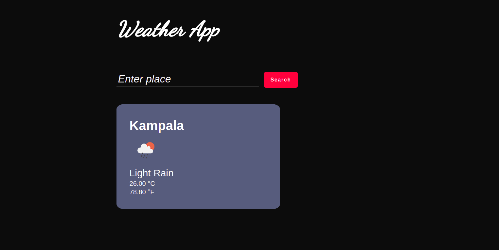

# Weather-App
A web app built with JavaScript and APIs that allows users to search and find current weather information of any place in the world.
The app displays the users current location by default on page load.
When the user enters a place to search, the app displays the searched place values

## Screenshot



## Live Demo

[See Live](http://pascalbyabasaija.me/Weather-App/dist/index.html)

## Getting started

Clone or fork the source code into your local machine
```
git clone https://github.com/Byabasaija/Weather-App.git
```
```cd``` into the cloned directory using
```
cd directory-name/
```

Open the directory in your favorite code editor e.g if your using Vs code
```
code .
```

Run ``` npm install ``` to install dependences

Navigate to  ``` dist/index.html ``` to run the project, or in your terminal run ``` npm start ``` and click on dist when your browser opens.


## Author
**Pascal Byabasaija**
- Linkedin: [Pascal Byabasaija](https://www.linkedin.com/in/pascal-byabasaija/)
- Github: [@Byabasaija](https://github.com/Byabasaija)

## 🤝 Contributions

Contributions, issues and feature requests are welcome!

Feel free to check the [issues page](issues/).


## Show your support

Give a ⭐️ if you like this project!

## Licence
MIT